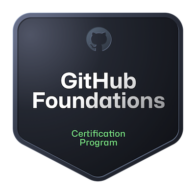

### Hi there, I'm Andrea Sgarbi 👋

My journey has been shaped by a genuine passion for programming and automation. Throughout my years of study and personal growth, I've come to understand that this is a path where learning never stops. I'm committed to continuously expanding my knowledge and skills to approach every project with professionalism and excellence.

---

## About Me 👨‍💻

**Education:** Master's Degree in Automation Engineering from Alma Mater Studiorum - Università di Bologna (Thesis: Machine Cloud Connectivity: a robust communication architecture for Industrial IoT)

**Current Role:** Industrial Automation Engineer

**Research/Focus Areas:** Robotics - Motion Axis Control - Industrial Automation - Industrial Protocols

I'm passionate about automation, software development, and industrial protocol integration. Currently, I'm focused on motion control systems, PLC programming, and industrial IoT solutions to improve manufacturing processes.  
Throughout my career, I've acquired extensive knowledge in software development, project managment and team collaboration in professional environments.  
However, I have a strong passion for programming in general and I would like to broaden my experience or learn new skills through open-source projects.

---

## Projects I've Worked On 🚀

Throughout my journey, I've worked on some exciting projects:

- **Cloud Connectivity for Industrial IoT** 🎯: Developed architecture for robust machine-to-cloud communication with Python and PLC, implementing security and privacy verification
  
- **Motion Control Systems** 💡: Designed and implemented trajectory calculations and axis movements for automatic machines using PLC programming

- **Real-Time Embedded Systems** 🔧: Built Real-Time control systems on Linux with EtherCAT Safety networks for pharmaceutical machines

- **Encoder Interfacing** 🖼️: Developed embedded controller interfaces for sin/cos encoders with serial communication

---

## Technologies I Love Working With 💻

I'm passionate about **industrial automation, motion control, and embedded systems**. Here are the tools I use:

- **Languages:** C++, Python, PLC (AWL-like/proprietary), HTML, Java
- **Frameworks & Libraries:** TwinCAT (Beckhoff), Linux Real-Time systems, EtherCAT
- **Tools & Platforms:** Git, Gitlab, GitHub, VSCode
- **Specializations:** PLC programming, Motion axis control, Industrial IoT, Cloud connectivity, Embedded systems, Real-Time systems, Safety systems (EtherCAT), Hardware-Software integration

Beyond my industrial automation expertise, I have a strong passion for general programming. I love studying algorithms and their applications in computer science, and I'm continuously learning new programming languages and frameworks for frontend, backend, and web application development. This diverse skill set allows me to approach problems from multiple angles and stay current with evolving technologies.

---
    

   
 LATEST BLOG POST :book: 

<!-- BLOG-POST-LIST:START -->
- [Don&#39;t Outsource the Learning](https://daily.dev/posts/ImeraOMcp?utm_source=rss&utm_medium=bookmarks&utm_campaign=jZu2oVM8P7ANqyhPj594t)
- [5 Best Udemy Courses to Learn AI Engineering in 2025](https://daily.dev/posts/6NRTRsvc5?utm_source=rss&utm_medium=bookmarks&utm_campaign=jZu2oVM8P7ANqyhPj594t)
- [No title](https://daily.dev/posts/HhnoOQQWR?utm_source=rss&utm_medium=bookmarks&utm_campaign=jZu2oVM8P7ANqyhPj594t)
- [No title](https://daily.dev/posts/5B9ShiWe5?utm_source=rss&utm_medium=bookmarks&utm_campaign=jZu2oVM8P7ANqyhPj594t)
- [Code Timeline Generator](https://daily.dev/posts/8d5kc29iZ?utm_source=rss&utm_medium=bookmarks&utm_campaign=jZu2oVM8P7ANqyhPj594t)
<!-- BLOG-POST-LIST:END -->

---

<h3 align="center">CERTIFICATION</h3>

---

<h3 align="center">SUPPORT</h3>

